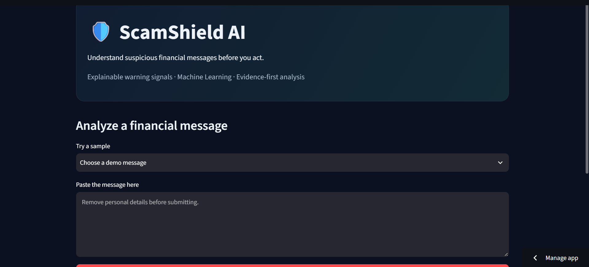

# ScamShield AI

An explainable warning tool for suspicious financial messages, built with Python and Streamlit.

You paste in a message (an investment offer, a payment demand, a "verify your account" text) and the app tells you what looks risky about it and why. It combines a set of hand-written rules with a small machine learning classifier. The goal is to help people slow down and verify a message, not to give a final verdict on it.

**Live demo:** [scamshield-ai on Streamlit](https://scamshield-ai-fyfhkxe4779egmd9tsvuhq.streamlit.app/)



> **Note:** This is an educational prototype. It is not a fraud detector or financial advice, and its output can be wrong. A result should never be treated as proof that a message is a scam or that it is safe.

## What it does

- **Rule-based checks:** flags patterns such as unrealistic return promises, urgent payment requests, and requests for sensitive information.
- **ML classification:** a TF-IDF + Logistic Regression pipeline labels each message as suspicious or not flagged.
- **Evidence in the output:** the dashboard highlights the exact text that triggered a rule and explains the reason.
- **Evaluation and validation scripts:** accuracy, precision, recall, F1, confusion matrix, cross-validation, and a dataset checker for bad labels, empty messages, and duplicates.
- **Safety guidance:** short, general tips on verifying a claim through official channels.

## Tech stack

Python, Streamlit, Pandas, scikit-learn, Joblib, Pytest.

## How it works

1. You enter a message in the dashboard.
2. The rule-based analyzer checks it against predefined warning patterns.
3. The trained classifier produces its own prediction.
4. The dashboard shows both results together with the matched text and explanations.

## Project structure

```text
ScamShield-AI/
├── app.py                  # Streamlit dashboard
├── requirements.txt
├── data/
│   └── messages.csv        # training data
├── models/
│   └── scam_classifier.joblib
├── screenshots/
├── src/
│   ├── analyzer.py         # rule-based warning signals
│   ├── predictor.py        # loads the model and predicts
│   ├── train_model.py
│   ├── validate_dataset.py
│   └── evaluate_model.py
└── tests/
    └── test_analyzer.py
```

## Running it locally

Requires Python 3.10+ and Git.

```bash
git clone https://github.com/MuhammadSharafat/ScamShield-AI.git
cd ScamShield-AI

python -m venv vscam
source vscam/Scripts/activate      # Git Bash on Windows
# .\vscam\Scripts\Activate.ps1     # PowerShell on Windows

pip install -r requirements.txt
```

Then, in order:

```bash
python -m src.validate_dataset   # check the dataset
python -m src.train_model        # train and save models/scam_classifier.joblib
python -m src.evaluate_model     # stratified cross-validation
streamlit run app.py             # launch the dashboard
python -m pytest -v              # run the tests
```

## Model performance (read this before trusting any number)

The dataset is tiny: **30 synthetic messages**, 15 per class. That means the numbers below say very little about real-world performance.

- **Holdout split:** 21 training / 9 test examples, 88.9% test accuracy (8 of 9 correct).
- **5-fold cross-validation:**

| Metric | Mean | Std. dev. |
|---|---:|---:|
| Accuracy | 86.7% | 19.4 pp |
| Precision | 85.0% | 20.0 pp |
| Recall | 93.3% | 13.3 pp |
| F1-score | 88.6% | 16.7 pp |

The standard deviations are large because each fold has only a handful of test messages. Results would shift noticeably with a different sample. The model's score is also not a calibrated probability of fraud.

## Privacy

- Remove names, account numbers, phone numbers, and other personal details before pasting a message.
- Never share OTPs, passwords, or PINs with anyone, including this app.
- Avoid entering sensitive information into the hosted version unless you have reviewed how it handles data and logging.

## Known limitations and next steps

- The dataset is small and synthetic. The most important next step is a larger, independently reviewed set of real examples.
- The model should be evaluated on unseen, representative data.
- Detection of unusual wording and new scam patterns is weak.
- Test coverage currently focuses on the rule-based analyzer. The ML pipeline needs tests too.
- Mobile layout and accessibility need work.
- Privacy and deployment practices should be tightened.

## Author

Muhammad Sharafat Alam, aspiring machine learning engineer.
[GitHub](https://github.com/MuhammadSharafat) · [Portfolio](https://sharafatalam.netlify.app/)
